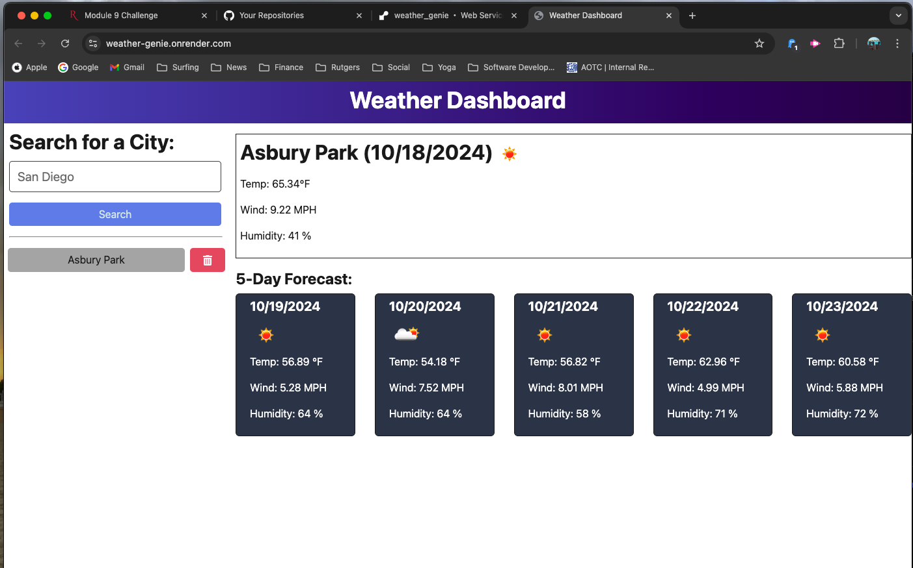

# Weather Genie

## Table of Contents:
- [Description](#description)
- [License](#license)
- [Application](#application)
- [Screenshot](#screenshot)
- [Questions](#questions)

## Description:
- This is a weather dashboard browser application that uses the Open Weather API to allow users to see current and forecasted weather by simply typing in their desired city.

  
## License:
- This project is licensed under the MIT license.

  
## Application:
- [Deloyed Application URL](https://weather-genie.onrender.com)

## Screenshot:

## Questions:
- This application was created by [Matt Morgan - My GitHub Profile](https://github.com/morgan4491), who can be reached via email at m.morgan4491@gmail.com for any additional questions.
